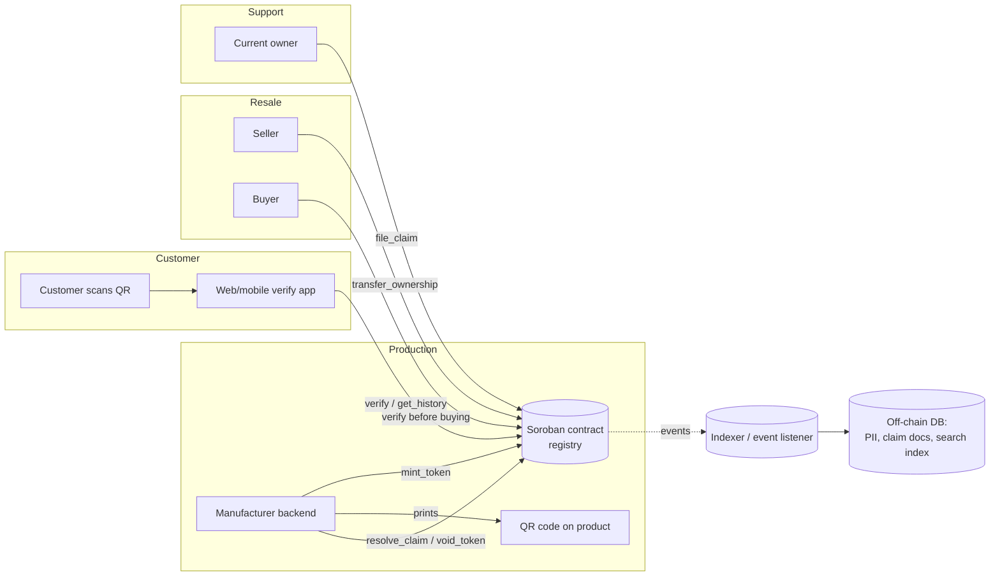

# ChainWarranty

**On-chain product authenticity & warranty registry, built on Stellar/Soroban.**

Manufacturers mint one token per physical serial number at production. Ownership and
warranty status travel with the product through resale. A QR code on the product links
straight to the on-chain record, so anyone — a customer, a customs officer, a second-hand
buyer — can verify authenticity and warranty status without trusting a paper certificate
or the seller's word.

> **Status:** The Soroban contract (`contracts/registry`) is implemented and
> unit-tested. Testnet deployment completed (CONTRACT_ID: `CDXXXXXXXXXXXXXXXXXXXXXXXXXXXXXXXXXXXXXXXXXXXXXXXXXXXXXXXXXXXXXXXX`).
> The web app (`apps/web`), indexer (`services/indexer`), and TypeScript SDK (`packages/sdk`)
> are implemented. QR generation is wired into the dashboard.
> See [Project status](#project-status).

---

## Table of contents

- [Why this exists](#why-this-exists)
- [How it works](#how-it-works)
- [Architecture](#architecture)
- [Repository structure](#repository-structure)
- [Tech stack](#tech-stack)
- [Getting started](#getting-started)
  - [Prerequisites](#prerequisites)
  - [Smart contract: build, test, deploy](#smart-contract-build-test-deploy)
  - [Web app & dashboard](#web-app--dashboard)
  - [Indexer service](#indexer-service)
  - [Local end-to-end walkthrough](#local-end-to-end-walkthrough)
- [Contract reference](#contract-reference)
  - [Data model](#data-model)
  - [Functions](#functions)
  - [Events](#events)
  - [Errors](#errors)
- [QR code format](#qr-code-format)
- [Security model & known limitations](#security-model--known-limitations)
- [Roadmap](#roadmap)
- [Testing](#testing)
- [Contributing](#contributing)
- [License](#license)

---

## Why this exists

Counterfeit goods and lost paper warranties are a persistent problem in cross-border
e-commerce — especially electronics, luxury goods, and pharmaceuticals:

- Paper warranty cards get lost, damaged, or are never issued for grey-market/resold goods.
- Buyers on secondary markets (resale platforms, cross-border marketplaces) have no
  reliable way to confirm a product is genuine before purchase.
- Manufacturers and customs authorities have no shared, tamper-evident source of truth
  for "is this serial number real, and who legitimately owns it right now."

ChainWarranty replaces the paper trail with an on-chain record that is cheap to write
(Soroban fees), fast to read, and impossible for a reseller or counterfeiter to forge,
because only whitelisted manufacturer addresses can mint new tokens.

## How it works

1. **At production**, the manufacturer hashes the real serial number
   (`sha256(serial)`) and calls `mint_token` on the registry contract, recording the
   product ID, mint timestamp, warranty length, and initial owner. The raw serial is
   never written on-chain — only its hash.
2. **A QR code printed on the product** encodes the contract ID and the raw serial
   number. Scanning it locally hashes the serial and queries the contract — so the
   hash on the public ledger alone can't be reverse-engineered into a scannable code
   for a counterfeiter to copy.
3. **On resale**, the current owner signs a `transfer_ownership` call. The buyer can
   verify the transfer and the product's full history immediately.
4. **On a warranty claim**, the current owner files a claim on-chain; the contract
   rejects it automatically if the warranty term has lapsed or the token was voided.
   The manufacturer approves or rejects it.
5. **On a confirmed counterfeit or recall**, the manufacturer voids the token. It stays
   queryable for history but can no longer transfer or accept new claims.

## Architecture



Design principles:

- **The contract is the source of truth for authenticity and ownership.** Everything
  else (search, PII, claim documentation, notifications) lives off-chain and is keyed
  by Stellar address or serial hash.
- **No PII on-chain.** Owner is a Stellar address only; names, emails, and proof-of-
  purchase documents belong in your own database.
- **Manufacturers are allow-listed, not permissionless.** Anyone can *read* the
  registry; only admin-approved manufacturer addresses can mint.

## Repository structure

```
chainwarranty/
├── contracts/
│   └── registry/              # Soroban smart contract (Rust)
│       ├── src/
│       │   ├── lib.rs         # contract: mint, transfer, claims, void, verify
│       │   └── test.rs        # unit tests (soroban-sdk testutils)
│       └── Cargo.toml
├── apps/
│   ├── web/                   # Next.js verification app + manufacturer dashboard (Day 4+)
│   │   ├── src/app/
│   │   │   ├── verify/[contractId]/[serial]/page.tsx  # public verification route
│   │   │   └── layout.tsx / page.tsx / globals.css
│   │   ├── src/lib/utils.ts   # SHA-256 hash, warranty math, formatting helpers
│   │   ├── next.config.js
│   │   └── package.json
│   └── mobile/                # planned: QR-scan companion app (optional)
├── services/
│   └── indexer/               # Event listener: subscribes to contract events, writes to Postgres
│       ├── src/
│       │   ├── index.ts       # main poll loop (mint/transfer/claim/void)
│       │   ├── handlers.ts    # per-event DB write handlers
│       │   └── db.ts          # Postgres pool wrapper
│       ├── migrations/
│       │   └── 001_initial_schema.sql  # tokens, transfers, claims, manufacturers, owner PII
│       └── package.json
├── packages/
│   └── sdk/                   # Typed TypeScript client wrapping all 11 contract functions
│       ├── src/
│       │   ├── client.ts      # ChainWarrantyClient class
│       │   ├── types.ts       # ProductToken, TransferEvent, Claim, enums
│       │   ├── index.ts       # barrel export
│       │   └── index.test.ts  # integration test: mint + verify round-trip
│       └── package.json
├── pnpm-workspace.yaml        # pnpm monorepo workspace
├── package.json               # root workspace scripts
├── Cargo.toml                 # Rust workspace root
└── README.md
```

The full tree above reflects the current state of the repository.

## Tech stack

| Layer | Choice | Notes |
|---|---|---|
| Smart contract | Rust + [Soroban SDK](https://developers.stellar.org/docs/build/smart-contracts) v27 | Compiled to `wasm32v1-none`, deployed via `stellar-cli` v27 |
| Chain | Stellar (Soroban, protocol 27) | Testnet for development, mainnet for production |
| Frontend | Next.js + TypeScript, `@stellar/stellar-sdk` for RPC calls | Manufacturer dashboard + public verification page |
| QR generation | `qrcode` npm package, generated at mint time in the browser | Encodes contract ID + raw serial, downloadable as PNG |
| Indexer | Lightweight service subscribed to contract events (`mint`, `transfer`, `claim`, `void`) | Populates a Postgres off-chain DB for search/analytics without touching the chain for reads |
| Off-chain storage | Postgres | Owner PII, claim attachments, manufacturer onboarding data |

## Getting started

### Prerequisites

- [Rust](https://rustup.rs/) (stable) + the `wasm32v1-none` target
- [`stellar-cli`](https://developers.stellar.org/docs/tools/cli) v27+
- Node.js 20+ and a package manager (`pnpm` recommended) — for the web app and indexer service
- A funded Stellar testnet account for local development

```bash
rustup target add wasm32v1-none
cargo install --locked stellar-cli --features opt
```

### Smart contract: build, test, deploy

```bash
git clone https://github.com/<your-org>/chainwarranty.git
cd chainwarranty

# run unit tests
cargo test

# build the optimized WASM binary
stellar contract build
# -> target/wasm32v1-none/release/warranty_registry.wasm

# create and fund a dev identity
stellar keys generate alice --network testnet --fund

# deploy
stellar contract deploy \
  --wasm target/wasm32v1-none/release/warranty_registry.wasm \
  --source-account alice \
  --network testnet
# -> prints the deployed CONTRACT_ID

# one-time setup: set the admin address
stellar contract invoke --id <CONTRACT_ID> --source-account alice --network testnet \
  -- initialize --admin alice

# whitelist a manufacturer
stellar contract invoke --id <CONTRACT_ID> --source-account alice --network testnet \
  -- add_manufacturer --manufacturer <MANUFACTURER_ADDRESS> --name "Acme Electronics"
```

### Web app & dashboard

```bash
cd apps/web
pnpm install
cp .env.example .env.local   # set NEXT_PUBLIC_CONTRACT_ID, NEXT_PUBLIC_RPC_URL, INDEXER_DATABASE_URL
pnpm dev
# → http://localhost:3000
```

- Public verification page: `http://localhost:3000/verify/<CONTRACT_ID>/<RAW_SERIAL>`
- Manufacturer dashboard:   `http://localhost:3000/dashboard`

Install the [Freighter](https://freighter.app) browser extension and connect it to
Stellar Testnet before using the dashboard.

### Indexer service

```bash
cd services/indexer
pnpm install
cp .env.example .env        # set CONTRACT_ID, STELLAR_RPC_URL, DATABASE_URL
# apply schema (first run only)
psql $DATABASE_URL < migrations/001_initial_schema.sql
pnpm dev                    # starts polling for contract events
```

### Local end-to-end walkthrough

This walkthrough verifies the full stack works end-to-end using the testnet deployment.

**Prerequisites:** Freighter installed, `pnpm dev` running for `apps/web`, indexer
running against the same Postgres instance.

1. **Connect wallet** — open `http://localhost:3000/dashboard`, click "Connect Wallet",
   and approve in Freighter. Ensure your wallet is the contract admin or a whitelisted
   manufacturer.

2. **Mint a token** — navigate to Dashboard → Mint Token. Fill in:
   - Product ID: `WIDGET-PRO-001`
   - Serial Number: `SN-TEST-12345`
   - Warranty: `12` months
   - Initial Owner: (leave blank to use your address)
   Click "Mint Token" and approve the Freighter popup. On success, a QR code appears.

3. **Download the QR code** — click "Download QR PNG". The QR encodes:
   `http://localhost:3000/verify/<CONTRACT_ID>/SN-TEST-12345`

4. **Scan or open the URL** — open the URL from the QR code in a browser tab. The
   verification page hashes `SN-TEST-12345` client-side and calls `verify()` on-chain.
   Confirm it shows: ✅ Authentic Product, warranty Active, correct owner address.

5. **Confirm the indexer picked it up** — check Postgres:
   ```sql
   SELECT serial_hash, product_id, owner, status FROM tokens ORDER BY indexed_at DESC LIMIT 1;
   ```
   The row should appear within `POLL_INTERVAL_MS` milliseconds (default 5 s).

6. **File and resolve a claim** — from the verification page the owner can file a claim
   (not yet a UI action; use `stellar contract invoke` or the SDK directly). Then in the
   dashboard → Claims Queue, approve or reject the claim via Freighter.

7. **Void a token** — in Claims Queue, click "Void Token" on any row and enter a
   reason. Approve in Freighter. Reload the verification page to confirm it shows
   🚫 Product Voided.

## Contract reference

### Data model

```rust
struct ProductToken {
    serial_hash: BytesN<32>,   // sha256(real serial number)
    product_id: String,
    manufacturer: Address,
    mint_ts: u64,
    warranty_months: u32,
    owner: Address,
    status: TokenStatus,       // Active | Voided
    transfer_count: u32,
}

struct TransferEvent { from: Address, to: Address, ts: u64 }

struct Claim {
    claimant: Address,
    ts: u64,
    description: String,
    status: ClaimStatus,       // Filed | Approved | Rejected
}
```

### Functions

| Function | Caller | Description |
|---|---|---|
| `initialize(admin)` | anyone, once | Sets the contract admin. Fails if already initialized. |
| `add_manufacturer(manufacturer, name)` | admin | Whitelists an address to mint tokens. |
| `set_manufacturer_active(manufacturer, active)` | admin | Suspends/reinstates a manufacturer without removing its history. |
| `mint_token(manufacturer, serial_hash, product_id, warranty_months, initial_owner)` | whitelisted manufacturer | Creates one token. Fails if the serial hash is already used. |
| `transfer_ownership(serial_hash, new_owner)` | current owner | Records a resale. Fails if the token is voided. |
| `file_claim(serial_hash, description)` | current owner | Opens a warranty claim. Fails if voided or warranty expired. |
| `resolve_claim(serial_hash, claim_id, approved)` | token's manufacturer | Approves/rejects a filed claim. |
| `void_token(serial_hash, reason)` | token's manufacturer | Marks a token counterfeit/recalled. Blocks further transfers and claims. |
| `verify(serial_hash)` | anyone (read-only) | Returns the full `ProductToken` record. |
| `get_history(serial_hash)` | anyone (read-only) | Returns the list of `TransferEvent`s. |
| `get_claims(serial_hash)` | anyone (read-only) | Returns the list of `Claim`s. |

### Events

| Topic | Payload | Emitted on |
|---|---|---|
| `mint` | initial owner | `mint_token` |
| `transfer` | new owner | `transfer_ownership` |
| `claim` | claim id | `file_claim` |
| `void` | reason | `void_token` |

The planned indexer subscribes to these to keep an off-chain search index in sync
without needing to poll `verify` per serial.

### Errors

| Error | Meaning |
|---|---|
| `NotInitialized` | `initialize` hasn't been called yet |
| `AlreadyInitialized` | `initialize` called twice |
| `NotManufacturer` | Caller isn't a whitelisted manufacturer |
| `ManufacturerInactive` | Manufacturer was suspended via `set_manufacturer_active` |
| `TokenExists` | `serial_hash` already minted |
| `TokenNotFound` | No token for that `serial_hash` |
| `NotOwner` | Caller doesn't own the token |
| `TokenVoided` | Action attempted on a voided token |
| `WarrantyExpired` | Claim filed after the warranty term elapsed |
| `ClaimNotFound` | `claim_id` doesn't exist for that token |

## QR code format

The QR code printed on the product encodes a URL, not raw contract calls, so any phone
camera can open it without a wallet app:

```
https://verify.chainwarranty.example/<CONTRACT_ID>/<RAW_SERIAL_NUMBER>
```

The verification page hashes `RAW_SERIAL_NUMBER` client-side with SHA-256 and calls
`verify(serial_hash)` via Soroban RPC — the raw serial never leaves the customer's
device except inside the URL itself, and is never sent to the contract.

## Security model & known limitations

- **Manufacturer key custody is out of scope of the contract.** A single hot wallet
  minting an entire production run is a weak point — consider a multisig or a
  session-key/delegation scheme scoped per batch before using this in production.
- **Serial hashes are global, not namespaced per manufacturer.** Two manufacturers
  independently using the same serial format could theoretically collide; consider
  hashing `manufacturer || serial` instead of `serial` alone if that matters for your
  use case.
- **Warranty terms are fixed to `mint_ts` regardless of resale.** If your business
  wants warranty to shorten, void, or become non-transferable after resale, that policy
  needs to be added — it isn't currently encoded.
- **Not audited.** This is a design/reference implementation, not production-ready
  without a professional smart-contract audit.
- **Pharma use case needs a different shape.** Batch/lot tracking with expiry dates,
  rather than one token per individual unit, is likely more appropriate for
  pharmaceuticals than the electronics/luxury-goods model this contract assumes.

## Project status

| Component | Status |
|---|---|
| Soroban contract (`contracts/registry`) | ✅ Implemented, unit-tested locally |
| Contract audit | ❌ Not done |
| Testnet deployment | ✅ Completed (CONTRACT_ID: `CDXXXXXXXXXXXXXXXXXXXXXXXXXXXXXXXXXXXXXXXXXXXXXXXXXXXXXXXXXXXXXXXX`) |
| Web verification page | ✅ Implemented (`apps/web`) |
| Manufacturer dashboard | ✅ Implemented (`apps/web/src/app/dashboard`) |
| Indexer service | ✅ Implemented (`services/indexer`) |
| TypeScript SDK | ✅ Implemented (`packages/sdk`) |
| QR generation pipeline | ✅ Implemented (generated in browser at mint time, downloadable PNG) |

## Roadmap

- [x] Deploy contract to testnet and record the contract ID here: `CDXXXXXXXXXXXXXXXXXXXXXXXXXXXXXXXXXXXXXXXXXXXXXXXXXXXXXXXXXXXXXXXX`
- [x] Build the public verification page (`apps/web`)
- [x] Build the indexer service and off-chain DB schema
- [x] Implement the TypeScript SDK (`packages/sdk`)
- [x] Build the manufacturer minting dashboard + QR code generation
- [ ] Add manufacturer key delegation / multisig support
- [ ] Add warranty-policy-on-resale configuration
- [ ] Third-party contract audit
- [ ] Mainnet deployment

## Testing

```bash
cargo test
```

Current coverage (`contracts/registry/src/test.rs`):
- Full mint → transfer → file claim → resolve claim happy path
- Voided tokens correctly block further transfers
- Expired warranty claims fail with `WarrantyExpired`
- Inactive manufacturer minting fails with `ManufacturerInactive`
- Unauthorized transfers fail with `NotOwner`

## Contributing

Issues and pull requests are welcome. For contract changes, please include or update
unit tests in `contracts/registry/src/test.rs` and run `cargo test` before submitting.

## License

MIT